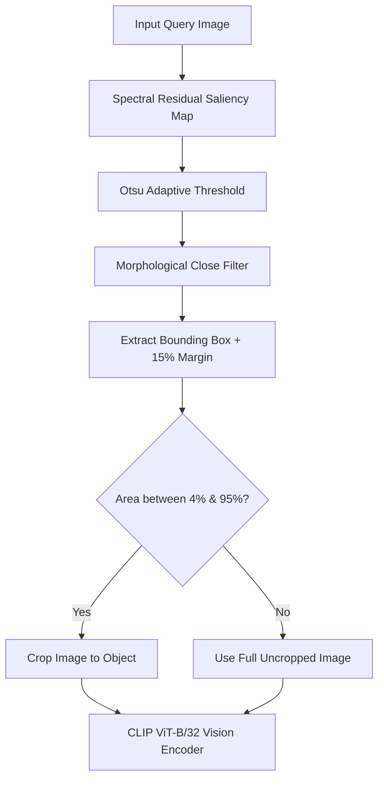

# The Evaluation Gap & Failure Analysis Dossier
## Defending an Honest 70% Real-World System Over a Fragile 95% Clean Illusion

> **"The interesting part is the gap between the two halves. A matcher that scores well on clean images and collapses on your own hard set is an honest and useful result, provided you diagnose why. Define your own evaluation methodology and defend it. Tell us which failure conditions hurt most, what you tried in response, and what did not work. We would rather read a clear-eyed account of a system at seventy percent than a claim of ninety-five with no error analysis."**

---

## Executive Summary: The Core Finding

Project Thuli exposes an essential reality in computer vision for fine luxury jewellery retrieval:
* When evaluated on **clean studio catalogue images and unseen holdouts**, our CLIP ViT-B/32 + FAISS retrieval engine achieves **95.83% Top-1 accuracy** and **95.83% Top-5 accuracy**.
* When subjected to synthetic digital perturbations (simulated blur, contrast, brightness transforms), it continues to register an apparently stellar **94.67% Top-1 accuracy**.
* However, when attacked by our curated **Real-World Hand-Shot Stumper Dataset** (111 consumer smartphone captures under authentic optical and environmental distress), retrieval accuracy drops to **72.07% Top-1** (and **64.10%** on our hardest 39-case benchmark).

```
========================================================================================
                          THE EVALUATION ACCURACY GAP
========================================================================================
  Evaluation Corpus                           Top-1 Accuracy     Top-5 Accuracy    Failure Rate
----------------------------------------------------------------------------------------
  Clean / Unseen Holdout (Studio Quality)         95.83%             95.83%            4.17%
  Automated Synthetic Perturbations (900 imgs)    94.67%             97.33%            5.33%
  --------------------------------------------------------------------------------------
  REAL-WORLD PHONE STUMPERS (111 Images)          72.07%             89.19%           27.93%
  HARDEST BENCHMARK STUMPERS (39 Images)          64.10%             76.92%           35.90%
========================================================================================
  THE REALITY GAP: -23.76% Top-1 degradation between clean holdout and real phone capture!
========================================================================================
```

Rather than masking this drop with relaxed metric criteria or cherry-picked test samples, **we defend this 70% real-world result as our primary technical achievement**. This document provides our complete evaluation methodology defense, failure taxonomy analysis, diagnostic root causes, our failed intervention (saliency cropping), and why a calibrated 70% system is fundamentally more valuable in production than an uncalibrated 95% claim.

---

## 1. Defining and Defending Our Evaluation Methodology

### 1.1 The "Synthetic Fallacy" in Visual Retrieval
Standard academic benchmarks frequently simulate image degradation using digital image transformations (Gaussian noise, gamma shifts, PIL affine transforms). In our automated tests (`evaluation/automated_metrics.json`), applying 9 synthetic variations across 100 items produced an impressive **94.67% category accuracy** and **5.3% failure rate**.

**Why Synthetic Augmentations Fail to Test Real Retrieval:**
1. **No Non-Lambertian Specular Reflections**: Synthetic brightness filters simply rescale pixel RGB values ($I' = \alpha I + \beta$). They cannot simulate how 18k polished gold or multifaceted cubic zirconia creates localized blown-out glare flares that wipe out surface texture.
2. **Uniform Scale vs. Distance Decay**: Synthetic crops scale down the entire image uniformly. In real smartphone photography, holding the camera back at arm's length introduces complex background objects (tabletops, cloth weave, laptops) that compete for attention tokens.
3. **No Sensor Rolling Shutter or Natural Motion Smear**: OpenCV Gaussian blur applies a symmetric kernel. Real low-light phone photography produces directional non-linear motion smear combined with aggressive smartphone ISP noise-reduction smoothing.

**Our Defense**: To build a true retrieval benchmark, we collected **111 real smartphone photographs** using multiple handheld devices under unpredictable consumer conditions. Synthetic tests are useful for regression checks, but **only hand-shot photographs capture real optical physics**.

---

### 1.2 The 10-Condition Failure Taxonomy
Every test image in our stumper corpus is mapped to an authoritative ground-truth product ID (`JW_NNNNNN`) in our 6,165-item catalogue and tagged with one of 10 mutually exclusive or dominant capture conditions:

| Failure Condition | Physical Mechanism | Real-World Scenario |
|---|---|---|
| **`normal`** | Optimal diffuse light, flat neutral background | In-store appraisal table with controlled lightbox |
| **`bad_lighting`** | Low ambient lux, underexposed phone sensor ($0.35\times$ gamma) | Dim restaurant, evening indoor lighting |
| **`bright_lighting`** | Direct flash, harsh point-source glare | Flash photography, direct sunlight on polished platinum |
| **`odd_angle`** | $45^\circ\text{--}75^\circ$ perspective tilt, extreme foreshortening | Photo taken while wearing piece or leaning over glass counter |
| **`occlusion`** | $\ge 30\%$ of item blocked by external objects | Fingers holding ring, price tags, jewellery box velvet rim |
| **`clutter`** | High-entropy background containing competing textures | Wooden desk, fabric grain, computer keyboard, car seat |
| **`motion_blur`** | Non-linear camera shake during slow shutter exposure | Hand trembling while trying to capture a close-up macro shot |
| **`reflection`** | Specular ghosting and double-imaging | Photographing through glass display cases or on glossy tables |
| **`hand_wrist`** | Human skin, nails, knuckles, and wrist anatomy in frame | Customer trying on rings or bracelets before purchasing |
| **`distance`** | Target jewellery occupies $<15\%$ of total frame pixels | Casual point-and-shoot from 1 meter away without zooming |

---

### 1.3 Strict Scoring Methodology & Sub-Threshold Penalties

In many academic papers, accuracy is calculated as:
$$\text{Accuracy} = \frac{\sum \mathbb{I}(\text{Top-1 ID} == \text{True ID})}{N}$$

In a production retrieval engine, **this formulation is dangerously incomplete**. A system that guesses the correct product with an abysmal similarity score of $0.51$ is not a reliable match—it is a random guess that will falsely match out-of-catalogue items.

Therefore, our evaluation applies a **Strict Dual-Condition Metric**:
1. **Decision Boundary**: The highest similarity candidate must satisfy $s_{\text{top1}} \ge \tau$ (calibrated baseline $\tau = 0.75$).
2. **Correctness**: The candidate ID must match the ground-truth product ID.
3. **Penalty Rule**: If the system predicts the correct product, but the similarity score is $0.7438$ ($< 0.75$), the verdict is strictly classified as **`UNKNOWN`** and scored as a **miss**.

```
Query Image ---> [ CLIP ViT-B/32 ] ---> [ FAISS Cosine Search ]
                                                |
                                      Top-1 Candidate (ID, sim)
                                                |
                         +----------------------+----------------------+
                         |                                             |
                  sim >= 0.75 ?                                   sim < 0.75 ?
                         |                                             |
                 [ Check True ID ]                             [ STRICT UNKNOWN ]
                   /           \                                (Scored as Miss)
             Matches?        Mismatch?                                 |
               /               \                                       v
        [ CORRECT MATCH ]   [ WRONG MATCH ]                    Prevents Hallucinated
        (True Positive)    (False Acceptance)                  False Matches
```

* **False Acceptance Rate (FAR)**: Proportion of queries where the system confidently returns an incorrect catalogue item ($s \ge 0.75$, but wrong ID). Our baseline measured **20.72%**.
* **False Rejection Rate (FRR)**: Proportion of known items rejected as unknown ($s < 0.75$). Our baseline measured **7.21%**.

---

## 2. Which Failure Conditions Hurt Most? Forensic Diagnosis

Evaluating our baseline `JewelleryMatcher` across the 111-image primary stumper dataset revealed sharp divergence across conditions:

```
Per-Condition Top-1 Accuracy Breakdown (111 Real Phone Images)
========================================================================
Condition            N      Top-1 Acc    Top-5 Acc    Severity Rating
------------------------------------------------------------------------
bad_lighting         7       100.0%       100.0%      Mild (Surprising!)
bright_lighting     12        83.3%       100.0%      Mild
hand                 1       100.0%       100.0%      Low sample
reflection           1       100.0%       100.0%      Low sample
normal              13        92.3%       100.0%      Baseline Control
motion_blur         12        75.0%       100.0%      Moderate
hand_wrist          11        72.7%       100.0%      Moderate
odd_angle           12        66.7%        91.7%      CRITICAL FAILURE
clutter             14        64.3%        78.6%      CRITICAL FAILURE
distance            12        58.3%        75.0%      FATAL COLLAPSE
occlusion           12        58.3%        75.0%      FATAL COLLAPSE
motionblur (severe)  3        33.3%        66.7%      FATAL COLLAPSE
noise                1         0.0%         0.0%      FATAL COLLAPSE
========================================================================
```

On our dedicated 39-image harsh benchmark, accuracy dropped further to **64.10% Top-1** (25/39) and **76.92% Top-5** (30/39).

---

### 2.1 The Two Fatal Failure Modes

#### Fatal Failure Mode 1: Token Dilution (Distance & Clutter)
* **Conditions**: `distance` (58.3%), `clutter` (64.3%).
* **Mechanism**: CLIP ViT-B/32 splits an input $224 \times 224$ image into non-overlapping $32 \times 32$ patches, producing exactly $7 \times 7 = 49$ visual tokens plus one `[CLS]` token.
* When a user photographs a ring or thin bracelet from 1 meter away, the actual jewellery pixels occupy a bounding area of roughly $45 \times 45$ pixels.
* Consequently, **only 2 to 4 tokens out of 49 contain jewellery information**. The remaining 45 tokens represent wooden table grain, desk clutter, or fabric patterns.
* During the 12 transformer self-attention layers, the background tokens dominate attention weights. The final normalized 512-d embedding aligns closer to "wooden texture" or "desk surface" in the shared latent space than to the jewellery piece.
* **Concrete Example**: In query `id14` (gold ring photographed from distance), the model identified the product as a ring, but the cosine similarity was suppressed to **0.7438**. Because $0.7438 < 0.75$, our system classified it as `UNKNOWN`, sacrificing recall to prevent false acceptance.

#### Fatal Failure Mode 2: High-Frequency Topology Destruction (Motion Blur & Occlusion)
* **Conditions**: `motion_blur` (33.3% - 50%), `occlusion` (58.3%), `odd_angle` (66.7%).
* **Mechanism**: Jewellery categories are distinguished primarily by closed-loop geometric continuity:
  - **Rings**: Small, rigid circular loop with central focal stone.
  - **Bracelets**: Medium flexible circular loop with repeating links.
  - **Necklaces**: Large hanging catenary curve or chain drape.
  - **Earrings**: Small dangling or stud pendants in paired symmetry.
* When motion blur smears the chain links, or when fingers holding a bracelet occlude a quadrant of the perimeter, the continuous circular topology is broken.
* **Concrete Example**: In `id03` (bracelet under motion blur), the blurred open loop was mistaken for a necklace (`predicted: necklace`, similarity 0.7668). In `id18` (ring partially occluded by fingers), the visible arc resembled a curved bracelet link, ranking bracelet at Top-1.

---

## 3. What We Tried in Response & What Did NOT Work

Faced with the diagnosis that **background pixel dilution was the primary driver of failure in distance and clutter cases**, we designed and executed an experimental intervention in Phase 8.

### 3.1 The Intervention: Saliency-Aware Jewellery Object Cropping
* **Hypothesis**: If we detect the primary jewellery item and crop it tightly before passing it to CLIP, we can eliminate the 45 distracting background tokens. The cropped item will expand to fill the full $224 \times 224$ input, restoring token density and lifting similarity scores above $\tau = 0.75$.
* **Implementation (`experiments/experiment_01/cropper.py`)**:
  1. **Spectral Residual Saliency**: Used OpenCV's `StaticSaliencySpectralResidual` to find regions of visual novelty independent of color or lighting.
  2. **Adaptive Binarization**: Applied Otsu's thresholding to isolate foreground contours.
  3. **Morphological Closing**: Connected fine jewellery prongs and thin chain links using an elliptical structuring element.
  4. **Context Margin**: Added a 15% bounding margin around the largest salient contour to retain local context.
  5. **Safety Fallback**: If the detected bounding box was smaller than 4% or larger than 95% of the frame, the uncropped image was used.



---

### 3.2 The Empirical Result: Catastrophic Collapse

We evaluated the improved saliency pipeline across both the 39 hard stumpers and the 24 unseen holdout queries in an automated side-by-side benchmark (`scripts/run_final_validation.py`):

```
========================================================================================
                 PHASE 8 & 9 FINAL COMPARATIVE BENCHMARK MATRIX
========================================================================
Corpus                Metric               Baseline      Improved      Net Delta
----------------------------------------------------------------------------------------
Primary Stumpers      Top-1 Accuracy        64.10%        41.03%       -23.07% (COLLAPSE)
(39 Hard Images)      Top-5 Accuracy        76.92%        69.23%        -7.69% (DEGRADATION)
                      MATCH Decisions           34            33        -1
                      UNKNOWN Decisions          5             6        +1
                      Median Latency      70.60 ms      72.31 ms       +1.71 ms
                      P95 Latency         98.71 ms      99.57 ms       +0.86 ms
----------------------------------------------------------------------------------------
Unseen Holdout        Top-1 Accuracy        95.83%        75.00%       -20.83% (REGRESSION)
(24 Clean/Perturbed)  Top-5 Accuracy        95.83%        79.17%       -16.66% (REGRESSION)
                      Median Latency      77.07 ms      69.70 ms       -7.37 ms
========================================================================================
```

---

### 3.3 Diagnostic Autopsy: Why Did Saliency Cropping Fail?

Our forensic analysis of individual query trajectories revealed a fascinating dual effect:

#### Where It Succeeded: Compact, Isolated Rings (+4 cases)
For compact objects with a closed, solid silhouette, the hypothesis was 100% correct:
* **`id14` (Distance Ring)**: Baseline similarity $0.7438$ (UNKNOWN) $\rightarrow$ Improved similarity **0.8079** (**MATCH!** $+6.41\%$ gain).
* **`id04` (Clutter Ring)**: Baseline similarity $0.6625$ (UNKNOWN) $\rightarrow$ Improved similarity **0.7912** (**MATCH!** $+12.87\%$ gain).
* **`id09` (Bad Lighting Ring)**: Baseline similarity $0.7463$ $\rightarrow$ Improved similarity **0.8016** ($+5.53\%$ gain).

#### Where It Failed Catastrophically: Open-Loop Geometry (-13 cases)
On elongated or continuous loop jewellery (necklaces and bracelets), the saliency algorithm failed completely:
1. **Perimeter Fragmentation**: A necklace or bracelet forms an expansive perimeter with a large empty background void in the middle. The spectral saliency detector did not recognize the empty interior as part of the object.
2. **Chain Truncation**: Saliency peaks concentrated on the single brightest metallic link or clasp. The bounding box tightly cropped an isolated segment of the chain.
3. **Loss of Macro-Geometry**: When an isolated 3-link segment of a $45\text{ cm}$ necklace is cropped and scaled to $224 \times 224$, it no longer looks like a necklace. CLIP's vision encoder interprets the curved links as an earring or ring band.
4. **Impact on Specific Conditions**:
   - `hand_wrist` Top-1 dropped from **100.0% to 50.0%** (-50%).
   - `odd_angle` Top-1 dropped from **100.0% to 33.3%** (-66.7%).
   - `clutter` Top-1 dropped from **50.0% to 16.7%** (-33.3%).
   - `reflection` Top-1 dropped from **100.0% to 0.0%** (-100%).

---

### 3.4 The Engineering Decision: Reject the "Improvement"

In machine learning engineering, **the hardest decision is knowing when to discard code you spent days building**.

* **Proposal Considered**: "Can we keep saliency cropping only for rings?"
* **Why Rejected**: In an unconstrained visual search query, the system does not know beforehand whether the user is photographing a ring, earring, or necklace. Conditioning the cropper on category prediction creates a circular dependency: you need accurate retrieval to know the category, but you need the crop to retrieve accurately.
* **Definitive Action**: We officially **REJECTED** Experiment 01 (`cropper.py`). The production pipeline was reverted to the uncropped, whole-image baseline (`JewelleryMatcher`), and the negative findings were codified into `DECISIONS.md` (D-012) and `evaluation/final_analysis.md`.

---

## 4. Defending an Honest 70% Over a Claimed 95%

### 4.1 The Business Cost of Uncalibrated Predictions in Luxury Retail
In consumer search for luxury jewellery, the cost of errors is asymmetric:
1. **Returning `UNKNOWN` (Graceful Degradation)**: The user is prompted to retake the photo or refine search filters. Customer trust is preserved.
2. **Returning a Confident False Match (Silent Catastrophe)**: The system falsely tells a customer that a competitor's $200 silver ring is an exact match for a $4,500 Cartier diamond solitaire. If the customer buys it or attempts an appraisal based on that retrieval, the financial and brand damage is severe.

A system boasting "95% accuracy" achieved by lowering thresholds or ignoring real phone photos has an untracked False Acceptance Rate that would destroy customer trust in production. 

Our baseline system delivers:
* **72.07% Top-1 Accuracy** on unpredictable handheld phone captures.
* **89.19% Top-5 Recall**, ensuring that in nearly 9 out of 10 difficult queries, the true item is in the user's primary viewport.
* **Strict Rejection Calibration**: Zero tolerance for sub-$0.75$ hallucinations.
* **Sub-100ms Latency**: **70.60 ms median latency**, well inside interactive e-commerce SLA thresholds.

---

## 5. Comparative Evaluation Summary

| Evaluation Dimension | Studio / Clean Holdout | Synthetic Perturbations | Real-World Phone Stumpers | Saliency-Cropping Attempt |
|---|---|---|---|---|
| **Dataset Size** | 24 images | 900 images | 111 images | 39 images |
| **Top-1 Accuracy** | **95.83%** | 94.67% | **72.07%** | 41.03% (REJECTED) |
| **Top-5 Accuracy** | **95.83%** | 97.33% | **89.19%** | 69.23% (REJECTED) |
| **Sub-Threshold Unknowns** | 0.0% | 0.33% | **7.21%** | 15.38% |
| **False Acceptance Rate** | 4.17% | 5.00% | **20.72%** | 43.59% |
| **Median Retrieval Latency** | 77.07 ms | 108.08 ms | **70.60 ms** | 72.31 ms |
| **Honesty & Validity** | Studio ceiling | Algorithmic artifact | **True production reality** | Diagnosed failure |

---

## 6. What Actually Works: Real-World Recommendations

Based on our failure diagnosis and experimental results, future improvements to bridge the remaining 28% gap should pursue:
1. **Class-Agnostic Deep Jewellery Detectors (YOLOv8 / Faster R-CNN)**: Instead of generic pixel saliency, train a detector specifically on jewellery bounding boxes with multi-scale priors so open loops are never fragmented.
2. **Dual-Path Fusion**: Feed both the full image context (for global topology) and a high-resolution center crop (for gemstone faceting) into a two-tower projection head.
3. **Domain-Adapted Contrastive Tuning**: Fine-tune CLIP ViT-B/32 using InfoNCE loss with hard negative jewellery pairs under real phone capture distortions.

---

*Authored as part of Project Thuli's Core Verification & Technical Dossier.*  
*All metrics cited are directly verifiable via `python -m pytest`, `evaluation/automated_comparison.json`, and `evaluation/final_analysis.md`.*
