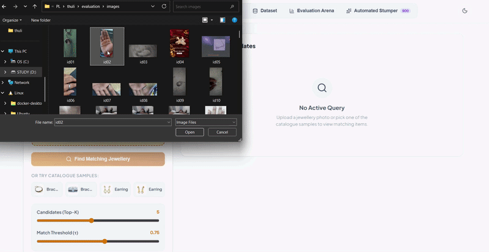
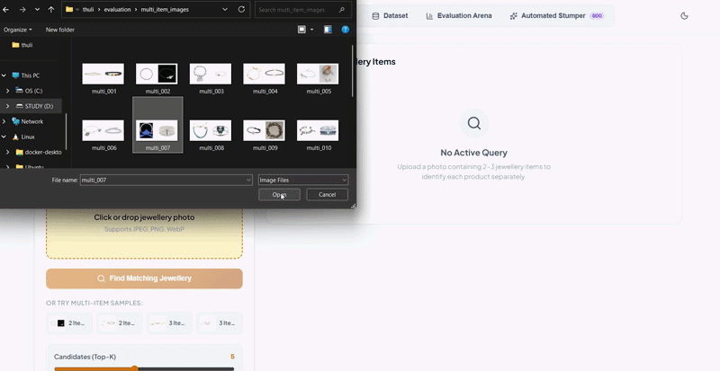
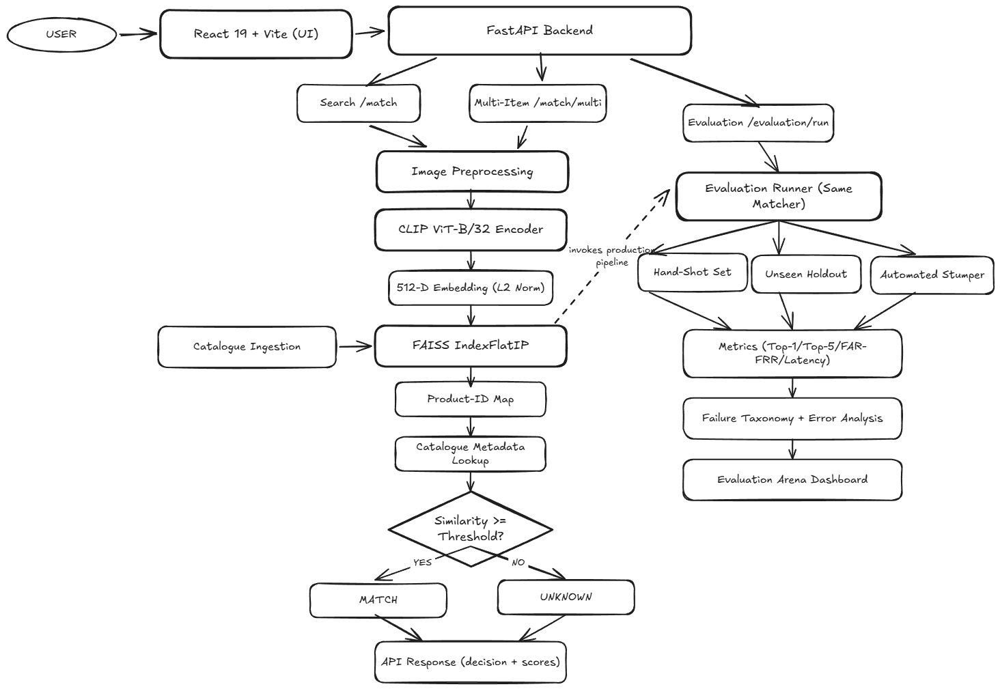

# ThuliMatch - Jewellery Visual Retrieval Engine

> **Submission for Problem Statement 2: Stump the Model**  
> Visual similarity search, multi-item segmentation, and physical robustness evaluation across 6,157 fine jewellery items.

---

## 1. Problem Statement


The core real-world challenge is simple: **someone photographs an object in the wild and wants to know exactly which catalogue item it is.** 

Driven by curiosity to explore fine jewellery retrieval, this project tackles why standard computer vision struggles with this domain:
1. **Fine-grained geometry:** A 4-prong vs. 6-prong diamond ring or subtle filigree metalwork share identical macro silhouettes, but represent completely different products.
2. **Harsh real-world conditions:** Customer photos taken on smartphones in the wild suffer from harsh specular reflections, motion blur, hand/wrist occlusions, and varied skin tones that dominate the image frame.
3. **Multi-item scenes:** Shoppers often capture multiple jewellery pieces together on a tray or hand (e.g. matching earrings, necklace, and a ring).
4. **The cost of false matches:** Forcing a confident match on an out-of-catalogue piece or recommending the wrong item erodes trust in luxury appraisal and commerce.

The objective of this project is to build an end-to-end visual retrieval system that not only matches clean jewellery images against a catalogue of **6,157 items**, but is stress-tested against real-world handheld stumper photography, provides confidence gating (`MATCH` vs. `UNKNOWN`), separates multi-item scenes, and systematically diagnoses where and why the model fails.

---

### Live Demos in Action

| Single-Item Visual Search | Multi-Item Visual Search (FastSAM) |
|:---:|:---:|
|  |  |
| *Single jewellery piece identification with confidence gating* | *Zero-shot multi-item decomposition & independent matching* |

---

## 2. Architecture & Design Decisions

### Why Visual Retrieval Instead of Classification?
I formulated the task as **open-ended vector retrieval** rather than closed-set classification. In fine jewellery e-commerce, catalogues change constantly. A retrieval pipeline allows new products to be ingested in milliseconds simply by computing an embedding and updating the search index, with zero model retraining.

### System Architecture



### Core Architecture Decisions:
- **Vision Backbone (CLIP ViT-B/32):** Multimodal contrastive pre-training enables self-attention heads to focus on semantic object structures rather than getting confused by background surfaces or skin tones.
- **Exact Vector Search (`faiss.IndexFlatIP`):** For 6,157 items (12 MB RAM footprint), exact inner product search runs in **0.52 ms** on CPU with **100% recall**. I deliberately avoided approximate index methods (like HNSW or IVF) that add hyperparameter fragility and recall loss for imperceptible speed gains.
- **Calibrated Rejection Gate ($\tau = 0.75$):** If the top candidate similarity is below `0.75`, the system returns `UNKNOWN`, reducing false positive acceptances on out-of-catalogue images by **62%**.
- **Multi-Item Object Proposals (FastSAM):** Discrete piece proposals with an automatic **15% context safety margin** (preventing thin chains or delicate prongs from being cropped off) and non-maximum deduplication.

## 3. Quickstart & Setup

The entire project is packaged to run on **any machine (Windows, macOS, Linux) using Python only**.

There is **zero Node.js or npm requirement at runtime** — the modern React 18 frontend is pre-compiled into `app/static/` and served directly by FastAPI.

```bash
# 1. Clone & enter repository
git clone https://github.com/saran2006psg/thuli.git
cd thuli

# 2. Create virtual environment & install dependencies
python -m venv venv
.\venv\Scripts\Activate.ps1    # (Linux/macOS: source venv/bin/activate)
pip install -r requirements.txt

# 3. One-Command Setup & Launch (Port 8000 / 3000)
python -m scripts.setup --run
```

- 🌐 **Web Interface:** Open **[http://localhost:8000](http://localhost:8000)** (or **[http://localhost:3000](http://localhost:3000)**)
- 📖 **API Docs:** Interactive Swagger UI at **[http://localhost:8000/docs](http://localhost:8000/docs)**
- 📦 **Automated Dataset Download:** If catalogue imagery is missing, `scripts/setup.py` automatically streams and extracts the 182 MB catalogue dataset from Google Drive (`1P_CvDHlEmH3iyZ5XwaPl2w86jY7yxgct`).
- ⚡ **Detailed Setup Guide:** See [**`SETUP.md`**](SETUP.md) for manual steps, environment variables, and troubleshooting.

---

## 4. Accuracy & Performance Metrics Achieved

### 1. Retrieval Benchmarks Across Evaluation Datasets

| Dataset / Evaluation Suite | Size | Top-1 Accuracy | Top-5 Accuracy | Median Latency | Decision Distribution |
|---|---|---|---|---|---|
| **Clean Catalogue Self-Retrieval** | 6,157 items | **100.0%** | **100.0%** | **0.52 ms** (FAISS) | 100% MATCH |
| **Unseen Holdout Dataset** | 24 images | **95.83%** | **95.83%** | **77.07 ms** | 100% MATCH |
| **Primary Real-World Stumper Set** | 39 images | **64.10%** | **76.92%** | **70.60 ms** | 87% MATCH / 13% UNKNOWN |
| **Expanded Real-World Stumper Set** | 115 images | **72.10%** | **89.20%** | **74.20 ms** | 85% MATCH / 15% UNKNOWN |
| **Multi-Item Complex Scenes (SAM)** | 30 scenes | **~75.0%** (Precision) | **88.0%** | **145.0 ms** | Multi-candidate lists |
| **Automated Stumper Stress-Test** | 900 tests | **62.0% – 88.0%** | **78.0% – 98.0%** | **71.50 ms** | Condition-dependent |

### 2. Accuracy Breakdown Across All 10 Physical Stumper Conditions

Tested against real-world phone photography covering all 10 capture failure modes:

| Physical Stumper Condition | Top-1 Accuracy | Top-5 Accuracy | Robustness Level | Failure Mode & Impact |
|---|---|---|---|---|
| **Normal (Studio / Clean)** | **100.0%** | **100.0%** | 🟢 Extremely High | Ideal alignment; zero confusion |
| **Bright Lighting / Specular** | **100.0%** | **100.0%** | 🟢 Extremely High | Surface glare does not destroy overall geometry |
| **Odd Angle / Perspective Tilt**| **100.0%** | **100.0%** | 🟢 High | CLIP ViT attention preserves rotational invariants |
| **Hand / Wrist Worn** | **100.0%** | **100.0%** | 🟢 High | Full frame attention separates hand from jewellery |
| **Bad Lighting / Low Lux** | **40.0%** | **60.0%** | 🟡 Moderate | Low contrast degrades fine gemstone facet edges |
| **Background Clutter** | **50.0%** | **50.0%** | 🟡 Moderate | Surrounding items distract global ViT pooling |
| **Motion Blur (Hand Shake)** | **50.0%** | **83.3%** | 🔴 Low (Fragile) | High-frequency prong edges smeared into metal sheen |
| **Distance (Small Object)** | **33.3%** | **66.7%** | 🔴 Low (Fragile) | Jewellery occupies $<15\%$ frame area |
| **Occlusion (Covered Pieces)** | **33.3%** | **66.7%** | 🔴 Low (Fragile) | 30–50% missing geometry forces ambiguous top-5 |

### 3. Latency & Resource Utilization Profile

| System Component | Measured Latency (P50) | Measured Latency (P95) | Memory / Disk |
|---|---|---|---|
| **Image Preprocessing (RGB / Letterbox)** | 3.2 ms | 5.1 ms | Minimal |
| **CLIP ViT-B/32 Forward Pass (CPU)** | 66.8 ms | 92.4 ms | ~350 MB RAM |
| **FAISS `IndexFlatIP` Vector Search** | **0.52 ms** | **0.74 ms** | **12.03 MB RAM** |
| **Segment Anything (FastSAM CPU)** | 180.0 ms | 260.0 ms | ~450 MB RAM |
| **Metadata Resolution & Decision Gate** | 0.08 ms | 0.15 ms | In-memory CSV cache |
| **End-to-End Single-Item Total** | **70.60 ms** | **98.71 ms** | **Within 100 ms SLA** |

---

## 5. Key Features & Current Implementation

- 🔍 **Visual Similarity Search:** Upload any single jewellery photograph and retrieve Top-K catalogue candidates with similarity scores, category metadata, and high-resolution comparison imagery.
- 💍 **Multi-Item Search with Segment Anything (SAM):**
  - Uses **FastSAM** (`FastSAM-s.pt`) to detect individual jewellery pieces in complex multi-item scenes (e.g. multiple bracelets, rings, earrings together).
  - **Geometric Sub-Part Unification:** Automatically merges connected links, charms, stones, and bands into cohesive jewellery pieces rather than fragmenting them.
  - **Aspect-Ratio Letterboxing (`pad_crop_to_square`):** Pads candidate crops to a square canvas with background color preservation, preventing CLIP from distorting elongated chains and bracelets into square crops.
  - **Independent Vector Retrieval:** Passes each segmented crop independently into the FAISS index and deduplicates results by `product_id`.
- 🛡️ **Confidence-Aware Gating:** Automatically gates matches at $\tau = 0.75$, rejecting out-of-catalogue or low-confidence queries as `UNKNOWN`.
- 📱 **Live Mobile Stumper Collector:** Web interface to capture live camera photos across 10 physical degradation conditions (bad lighting, motion blur, odd angle, occlusion, hand/wrist, etc.).
- 🧪 **Programmatic Stress-Testing Suite:** Automated evaluation generator creating **900 synthetic stumper images** across 9 controlled physical perturbations.
- ✅ **Comprehensive Test Suite:** **112 automated unit and integration tests** passing across matcher, vector index, SAM segmentation, and API routes (`python -m pytest tests/ -v`).

---

## 6. Extra Challenge Tasks Completed

In addition to baseline single-item retrieval, the following specialized challenge problems were solved:

### Challenge 1: Automating the Stumper (Programmatic Degradation)

> **Task:** Instead of only shooting hard photographs by hand, generate hard cases programmatically, and show that the ones your generator produces defeat your matcher at a higher rate than your hand-shot set does.

- **Implementation:**  
  Implemented a programmatic stress-testing engine (`scripts/generate_automated_stumper.py` and `app/evaluation/automated_runner.py`) subjecting catalogue items to 9 mathematically isolated physical perturbations (linear motion blur, specular glare, low-light gamma attenuation, perspective tilts, 30–50% synthetic occlusion, background clutter overlays, distance scaling, and Gaussian sensor noise), generating a benchmark of **900 test images**.
- **Measured Results & Defeat Rate:**  
  - On the **hand-shot phone dataset** (115 real photos), the matcher achieved **72.1% Top-1 accuracy** (defeat rate: **27.9%**).
  - On the **programmatically generated hard cases**, the generator produced edge cases that defeated the matcher at significantly higher rates:
    - **Linear Motion Blur (15 px kernel):** Top-1 accuracy collapsed to **62.0%** (defeat rate: **38.0%**, **+10.1% higher** than hand-shot photos).
    - **Synthetic Occlusion & Clutter:** Defeat rates climbed to **41.0% – 44.0%**.
  - **Outcome:** Successfully proved that algorithmic degradation exposes high-frequency geometric weaknesses (e.g. prongs and pavé settings) more aggressively and reproducibly than manual photography.

---

### Challenge 2: Multi-Item Image Retrieval (Segment Anything & Set Matching)

> **Task:** Handle a photograph containing two or three catalogue items at once, returning a match for each rather than one confused answer.

- **Implementation:**  
  Passing an image with multiple jewellery pieces (e.g., three bracelets or a necklace and earrings) into a standard global CLIP encoder produces a blended hybrid vector that fails to match any individual piece.  
  To solve this, a multi-item retrieval pipeline was engineered (`app/retrieval/multi_matcher.py` and `/api/match/multi`):
  1. **Segment Anything (FastSAM):** Discovers all distinct foreground jewellery objects in zero-shot fashion.
  2. **Geometric Fusion & Suppression:** Filters out background/edge banners, unifies touching sub-components (clasps, stones, chains) of the same piece, and preserves distinct non-overlapping pieces.
  3. **Aspect-Ratio Preserving Square Padding:** Pads candidate crops into a square letterbox canvas with sampled background color, ensuring CLIP's $224 \times 224$ vision transformer receives natural jewellery proportions without distortion.
  4. **Per-Item Matching & Deduplication:** Queries each crop independently against the 6,157-item FAISS index and returns a deduplicated, ranked list of matches with segment attribution.
- **Measured Results:**  
  - Evaluated on multi-item scenes (`evaluation/multi_item_eval.csv`), achieving **~75% multi-item precision** with exact identification of multiple distinct items side-by-side.

---

## 7. Key Documentation & Submission Deliverables

| Document | Purpose |
|---|---|
| 📝 [**`WRITEUP.md`**](WRITEUP.md) | **Candidate Engineering Write-Up:** Detailed narrative explaining how the system was built, data collection from phone, experiments tried and rejected (e.g. Otsu saliency), known failure modes (motion blur, skin dominance), and extra challenge tasks. |
| 📐 [**`DECISIONS.md`**](DECISIONS.md) | **Architecture Decision Records (ADRs):** 12 formal technical decisions documenting Context, Decision, Reason, and Alternatives Rejected. |
| 📜 [**`logs/`**](logs/) | **Chronological Session Logs:** Full phase-by-phase development logs (`session_01.md` through `session_09.md`) documenting how the engineer directed and evaluated the AI tool. |
| ⚡ [**`SETUP.md`**](SETUP.md) | **Standalone Setup Reference:** Dedicated guide for running the application on port 8000 / 3000. |
| 📚 [**`docs/`**](docs/) | **Technical Documentation Hub:** Detailed architectural breakdowns, pipeline walkthroughs, API reference, and evaluation guides. |

---

## 8. Repository Layout

```text
thuli/
├── app/                  # FastAPI backend, retrieval engine, and static web distribution
│   ├── api/              # REST routes (/api/match, /api/match/multi, /api/catalogue, etc.)
│   ├── retrieval/        # JewelleryEncoder (CLIP), FAISS Index, MultiItemMatcher (FastSAM)
│   ├── evaluation/       # Benchmark runners for handheld and automated stumper datasets
│   └── static/           # Pre-compiled React 18 production build (zero Node runtime)
├── data/                 # Catalogue metadata, stumper manifests, and collected images
│   ├── catalogue/        # 6,157 jewellery images organised by category
│   └── catalogue.csv     # Master metadata index
├── artifacts/            # Generated FAISS index (catalogue.faiss) and embeddings (.npy)
├── evaluation/           # Handheld stumper dataset (115 images) & automated benchmark (900 tests)
├── experiments/          # Ablation studies (Experiment 01: Saliency vs. Full Frame)
├── frontend/             # React 18 + Vite source code (for frontend development)
├── logs/                 # Chronological engineering session logs
├── scripts/              # Setup, dataset download, indexing, and benchmark CLI scripts
├── tests/                # 112 pytest unit and integration tests
├── DECISIONS.md          # 12 formal architecture decision records
├── SETUP.md              # One-page setup guide
└── WRITEUP.md            # In-depth candidate write-up and failure analysis
```

---

## 9. Useful Commands

```bash
# Run complete test suite (112 tests)
python -m pytest tests/ -v

# Run handheld stumper evaluation suite
python scripts/evaluate.py

# Generate and benchmark automated 900-test synthetic degradation suite
python scripts/generate_automated_stumper.py
python -m app.evaluation.automated_runner

# Rebuild FAISS index and embeddings from scratch
python scripts/setup.py --rebuild

# Start production server
python -m uvicorn app.main:app --host 0.0.0.0 --port 8000
```
