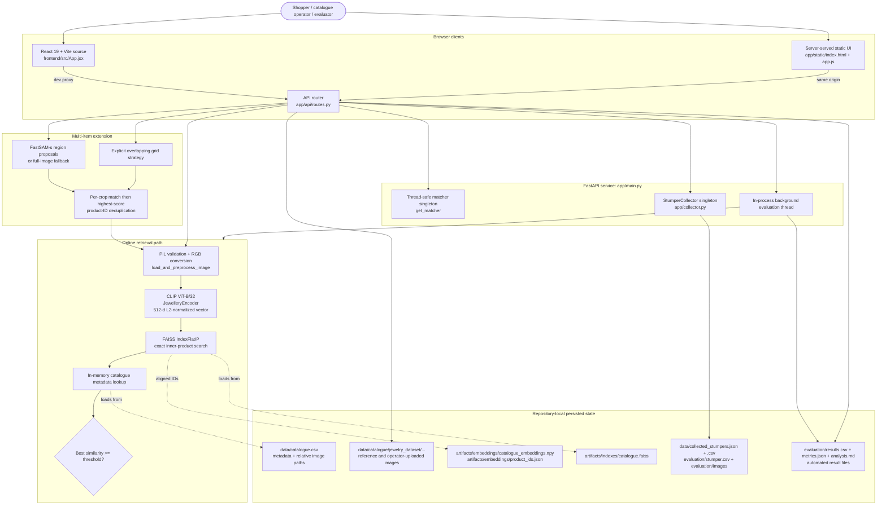
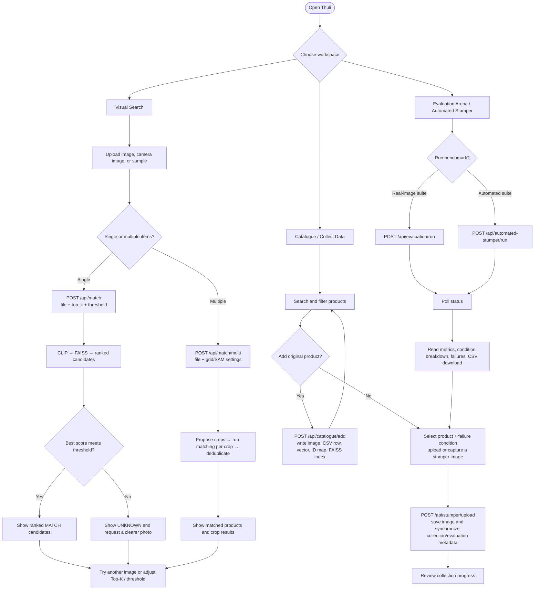

# Implementation architecture and user flows

This document describes the implementation that is currently present in the
repository. It is intentionally separate from the experimental dossier in the
root README: it records runtime boundaries, persisted state, and operational
risks so the diagrams remain useful as the product changes.

## System context and implementation architecture

### Runtime responsibilities

| Area | Implementation | Responsibility |
| --- | --- | --- |
| Application bootstrap | `app/main.py` | Pre-warms the matcher, mounts `/data`, evaluation images, `/static`, and `/assets`, then serves the static UI from `/`. |
| API boundary | `app/api/routes.py` | Validates multipart uploads and exposes match, catalogue, stumper, health/statistics, and evaluation endpoints under `/api`. |
| Single-item retrieval | `app/retrieval/matcher.py` | Preprocesses an image, encodes it, queries FAISS, resolves product metadata, and emits `MATCH` or `UNKNOWN`. |
| Multi-item retrieval | `app/retrieval/multi_matcher.py` | Uses FastSAM proposals or the selected grid, calls the single-item matcher for each crop, and deduplicates successful top matches. |
| Data collection | `app/collector.py` | Stores one image per product/condition, synchronizes stumper metadata, and refreshes evaluation results in a background thread. |
| Evaluation | `app/evaluation/runner.py`, `automated_runner.py` | Scores the real-image and generated-image benchmarks and writes versioned-on-disk reports. |
| Offline preparation | `scripts/generate_embeddings.py`, `build_index.py`, `setup.py` | Creates normalized catalogue embeddings, the aligned product-ID mapping, and the FAISS index. |

## User-flow diagram

## Implementation-grounded review

The repository has the pieces of a capable local demonstration and evaluation
environment. These are the changes that would make it production-ready and
make its documentation more trustworthy.

1. **Make catalogue writes atomic and serialized.** `add_catalogue_item()` mutates an image, FAISS index, ID mapping, optional embedding matrix, CSV, and memory state in sequence. A process crash or concurrent request can leave these artifacts misaligned. Use one write lock, write each artifact to a temporary sibling file, validate the vector/ID/CSV counts, then atomically replace files. A database plus object storage is the stronger long-term boundary.
2. **Move background evaluation to a job worker.** The current in-process daemon thread and module-global progress are lost on restart and cannot safely coordinate multiple Uvicorn workers. Persist jobs and progress in a queue/database (for example, Redis + RQ/Celery/Arq), and return a stable job ID.
3. **Harden upload and API access.** The service has open CORS with credentials, no authentication/authorization, and no explicit upload size, image-pixel, or rate limits. Restrict origins, disable credentialed wildcard CORS, protect catalogue/evaluation mutations, and enforce MIME, byte, and decompressed-image limits.
4. **Make multi-item fallback truthful and deterministic.** `generate_sam_crops()` silently catches all FastSAM failures and returns one full-image crop; it does not automatically select the documented grid fallback. Either log/return a `fallback_used` field and explicitly run `generate_grid_crops()`, or show the operator that segmentation was unavailable. Also add and pin `ultralytics`, which is imported at runtime but is absent from `requirements.txt`.
5. **Choose one shipped frontend.** Both `frontend/` (React/Vite source) and `app/static/` (server-served HTML/JS plus multiple hashed bundles) exist, but the FastAPI entry point serves only `app/static`. Define a build-and-copy release command or serve the Vite build directory so source, production UI, and API contract cannot drift.
6. **Correct documentation and metric source-of-truth.** The checked-in `catalogue.csv` currently has 6,195 distinct product IDs, while project documents contain several different counts. Generate catalogue size and benchmark claims from artifacts/metrics during release, and keep one canonical architecture document—this one—for runtime behavior.
7. **Add operational observability.** Emit structured logs and metrics for model/index load failures, inference latency, request size, decision distribution, FAISS/ID-map length parity, fallback use, and background job errors. Add a readiness endpoint that fails when the model, index, mapping, and catalogue are inconsistent.

## Release invariants

Before release, verify all of the following:

- `len(product_ids) == faiss_index.ntotal == embedding_rows == distinct catalogue product IDs`.
- Every `image_path` is repository-relative and resolves to an image.
- A single-item upload returns either a ranked `MATCH` or an explicit `UNKNOWN`; it never exposes an unhandled exception.
- A failed FastSAM load is visible in the API response and follows the agreed grid/full-image fallback.
- Catalogue and stumper mutations require an authorized role and are recoverable from backups.
- The deployed frontend is generated from the same revision as the API.
